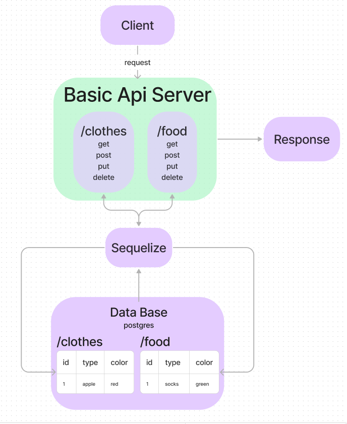

# basic-api-server

## 401d53 Lab 4 basic api server with collections and associations

## Project: Basic api server

### Author: Justin Mathieu

## Problem Domain

- Practice with basic server, collections class and associations.

## Links and Resources

- [GitHub Actions](https://github.com/Justin-Mathieu/basic-api-server/actions)
- [back-end prod url](https://basic-api-server-gum1.onrender.com)

## Collaborators

401d53 and 401d10
Used demo code as permitted.

## Setup

- port variable
- Connection string for database.  

## How to initialize/run your application (where applicable)

- Clone repo
- Run npm i in terminal
- Run nodemon in terminal

## Routes

- GET : /food - Gets all entries.  
- GET : /food/:id - Gets a specific entry by id.  
- PUT: /food/:id - Updates a specific entry.  
- DELETE : /food/:id - Deletes a specific entry by id.  
- POST : /food - Creates an entry.  

- GET : /clothes/:id - Gets a specific entry by id.  
- GET : /clothes - Gets all entries.  
- PUT: /clothes - Updates a specific entry by id.  
- DELETE : /clothes - deletes a specific entry by id.  
- POST : /clothes - Creates an entry.  

## Tests

- Run the command npm test with dependencies installed.

## UML

